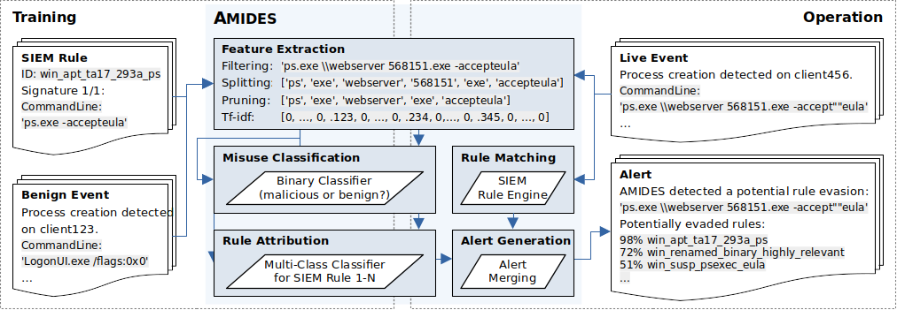

# Adaptive Misuse Detection System (AMIDES)

The Adaptive Misuse Detection System (AMIDES) extends conventional rule matching of SIEM systems by applying machine learning components that aim to detect attacks evading existing SIEM rules as well as otherwise undetected attack variants. It learns from SIEM rules and historical benign events and can thus estimate which SIEM rule was tried to be evaded. An overview of AMIDES is depicted in the figure below.

 Incoming events are transformed into feature vectors by the feature extraction component. During operation, features learned during the training phase will be re-used by the feature extraction component. Feature vectors are then passed to the Misuse Classification component, which classifies events as malicious or benign. In case of a malicious result, the feature vector is passed to the Rule Attribution component, which generates a ranked list of SIEM rules potentially evaded by the event.

This repository contains the source code used for model training, validation, and evaluation, as well as some initial training and validation data that enable to build and evaluate models for AMIDES.
For operational use, AMIDES is integrated into [Logprep] (https://logprep.readthedocs.io/en/latest/user_manual/configuration/processor.html#amides).

## System Requirements

AMIDES was developed and tested on Linux using Python 3.10. Before attempting to use AMIDES, make sure you have

- Physical or virtual host with a Linux-based OS
- A minimum of 8 GB of RAM
- At least 1 GB of HDD space
- Python 3.10 (or newer)

The repository also contains a `Dockerfile` that enables to create a quickstart environment with AMIDES and all the required dependencies already installed. To build and use the quickstart environment, Docker is required. Building and using the quickstart environment has been tested using Docker 20.10.

## Accessing Code and Initial Data

In order to access the AMIDES source code and initial data, change into the target location on your system and clone the repository by executing

    git clone https://github.com/fkie-cad/amides.git

or

    git clone git@github.com:fkie-cad/amides.git 

in case you prefer to use SSH.

Alternatively, you can get the repository by downloading the `.zip`-file from the repository's main page and unpack it into your target location.

The `amides` package in the `amides` directory contains modules and scripts that enable to train and validate models for AMIDES, evaluate the model's classification performance, and create meaningful visualizations that help users to assess the models classification performance. The package also contains additional scripts and classes that help to prepare generated models for operational use with Logprep and perform further testing.

Initial data to train and validate models for AMIDES is provided in the `data` directory. The `socbed` folder contains a small set of benign event logs for each of the four different rule types that AMIDES was tested with: Windows Process Creation, Web Proxy, Windows Registry, and Windows PowerShell. The provided benign data was generated using [SOCBED](https://github.com/fkie-cad/socbed).

Converted Sigma rules, matches, and a small number of evasions already revealed in the corresponding [academic research paper](#documentation) are located in the `data/sigma` folder. Converted rules required for model training are located in `data/sigma/rules`, matches and evasions required for model validation  are located in `data/sigma/events`.

## Installing  ##

Like other Python packages, the `amides` package can be installed system-wide, or into a Python virtual environment. We highly recommend using a dedicated virtual environment for `amides`. Virtual environments can be created using either the `venv` or `virtualenv` package. To create a dedicated virtual environment for `amides`, execute

    python3 -m venv <VIRTUAL-ENVIRONMENT-LOCATION>

or

    python3 -m virtualenv <VIRTUAL-ENVIRONMENT-LOCATION>

in case you want to use `virtualenv`. After the environment has been created, activate it by executing

    source <VIRTUAL-ENVIRONMENT-LOCATION>/bin/activate

To install the `amides` package and the required dependencies, change into the `amides` directory and execute

    pip install --upgrade pip
    pip install -r requirements.txt
    pip install .

## Running Experiments ##

## Building and Using the Quickstart Environment ##

As an alternative to installing the `amides` package on your local system, we provide a `Dockerfile` to create an AMIDES quickstart environment where `amides` and all its requirements are already installed. Building and running the quickstart environment requires a Docker installation.

In order to build the `amides:base` image of the quickstart environment, containing `amides` and all its dependencies, execute the

    build_image.sh 

script located in the project's root folder. This will execute the corresponding `docker build` command. The image is based on the `python:3.11-slim-bookworm` image. If the image is no longer needed at some point, it can be removed by executing the `remove_image.sh` script.

After the `amides:base` image has been successfully created, executing the

    create_containers.sh

script will create two separate containers: `amides-results` and `amides-env`.

The `amides-results` container is specifically created to execute the `results.sh` script described in the [experiments](#running-experiments). The container is configured to mount the `amides/plots`, `amides/models`, and `data` directories of the container as bind mounts onto the local file systems. This means that plots and models generated during the experiment execution will be available in the equally named directories on the local system.

The `amides-env` container provides the actual quickstart environment for AMIDES. Starting the container runs a bash script inside the container, which can then be used to execute several scripts of the `amides` package, including training and validating, plotting results, etc. The `amides-env` container supports the same bind mounts as the `amides-results` container, which means event data placed in the `data` folder are accessible from within the container. Models, results, and plots 

## Documentation

The corresponding academic research paper will be published in the proceedings of the 33rd USENIX Security Symposium:

R. Uetz, M. Herzog, L. Hackländer, S. Schwarz, and M. Henze, “You Cannot Escape Me: Detecting Evasions of SIEM Rules in Enterprise Networks,”
in *Proceedings of the 33rd USENIX Security Symposium (USENIX Security)*, 2024.[[DOI]()] [[arXiv]()]

## License

The files in this repository are licensed under the GNU General Public License Version 3. See [LICENSE](LICENSE) for details.

If you are using AMIDES for your academic work, please cite the paper under [Documentation](#documentation).
